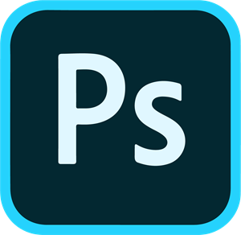
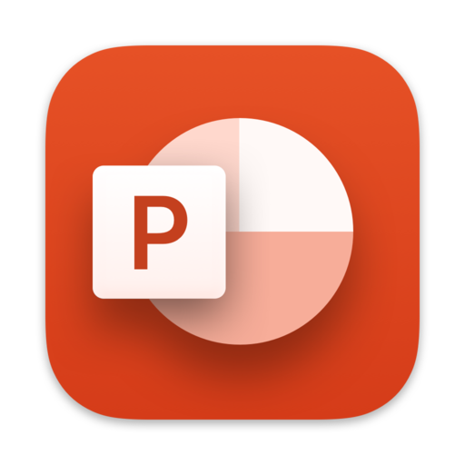

<h1 align="center">Hello !🌴, I'm Rizouie</h1>
<h3 align="center">A Graphic Designer🖌, who makes a lot of things. Such as : UI, Banner, Logo ,Thumbnail and Advert Design In short, all the graphic identity of a person or a project 😀!</h3>

  

## 🎑 About Me :
- 📝 I’m currently learning **Coding, and I am not gonna say no for some help 😅.**

- 📎 All of my projects available there : _Currenty unavailabe, Comming Soon !_

- 📩 You can reach me on this email : **_Rizer3500@gamil.com_**

- 💡 Fun fact, **I don't like to use email to reach me. If you want, you can do it on Discord 👇.**

                                                                              
&nbsp; <i><b>Languages Currently Learning:</b></i> 
    
  &nbsp;
  &nbsp;
  &nbsp;
  &nbsp;
  

&nbsp; <i><b>Tools Known:</b><i>
   
  &nbsp;
  &nbsp;
  &nbsp;
  &nbsp;

  <i><b>Profiles:</b></i>  
  <a href="mailto:Rizer3500@gmail.com">
    &nbsp;
  </a>
  <a href="https://discord.com/users/536145260204785677">
    &nbsp;
  </a>
  <a href="https://twitter.com/Rizouie">
    &nbsp;
  </a>

